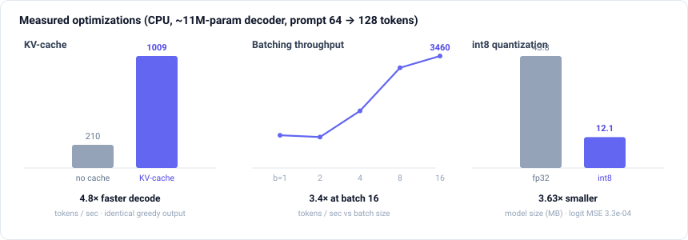

# llm-inference-performance

> LLM inference **performance engineering**, end to end: a device-aware benchmark
> harness (p50/p95 latency · tokens/sec · peak memory) and **measured
> before/after** optimizations — KV-cache, batching, and int8 quantization — plus
> a Megatron-style tensor-parallel MLP + all-reduce micro-benchmark (gloo on CPU,
> NCCL on GPU) and a custom fused-RMSNorm CUDA kernel.

[](https://github.com/kornsour/llm-inference-performance/actions/workflows/ci.yml)
&nbsp;Python 3.14 (runs on 3.12+) · PyTorch · runs on CPU (no GPU required) · GPU-portable (`--device cuda`)

---

## Why this exists

Inference performance engineering is about making model serving **measurably
faster and more memory-efficient** — utilizing every FLOP and every GB of GPU RAM
— with the distributed-systems framing of real serving infrastructure. This repo
demonstrates that skill set as a small, readable, **reproducible** lab: a compact
GPT decoder, a benchmark harness that reports the metrics an inference team
actually tracks, and optimizations whose wins are **measured**, not asserted.

It runs entirely on CPU (developed on Apple Silicon, no NVIDIA GPU), so anyone
can clone it and reproduce the numbers. The **same harness and code paths run on
GPU** with `--device cuda` — that's where the custom CUDA kernel and the NCCL
backend activate.

> **Companion repo.** This is the low-level *performance* project. For the
> *platform / SRE* side of inference — autoscaling, GitOps, observability, SLOs,
> cost — see **[`inference-platform`](https://github.com/kornsour/inference-platform)**.

## Results (measured)

Reproduce with `make bench`. Numbers below: ~11M-param decoder
(6 layers / 6 heads / 384 d), prompt 64 → 128 new tokens, CPU (Apple Silicon),
PyTorch 2.13. Full machine-readable report in
[`benchmarks/results/latest.json`](benchmarks/results/latest.json); rendered page
in [`docs/results.md`](docs/results.md).



### 1. KV-cache — **4.8× faster decode**

Greedy decoding, so cache-on and cache-off produce **identical tokens** (asserted
in tests) — a clean like-for-like comparison.

| variant | tokens/sec | p50 latency (ms) | p95 latency (ms) | peak mem (MB) |
| --- | --- | --- | --- | --- |
| no cache — recompute prefix each step, O(T²) | 210 | 608 | 613 | 9.0 |
| **KV-cache** — decode O(T) | **1009** | **127** | **127** | **7.04** |

**The cache costs memory, it doesn't save it.** It holds **3.52 MB** of K/V
resident at 192 tokens, growing linearly with sequence length and batch size —
that is the price of the 4.8×. Its *peak* still comes in under the no-cache
path's because recomputing the prefix every step materializes far larger
attention intermediates; and most of the 7.04 MB is the `torch.cat` that grows
the cache one token at a time, holding old and new buffers at once (a
preallocated cache is the standard fix). Peak memory is the high-water mark of
tensor bytes allocated inside each decode, above the resident model — see
[`docs/methodology.md`](docs/methodology.md).

### 2. Batching — **3.4× throughput** at batch 16

| batch size | 1 | 2 | 4 | 8 | 16 |
| --- | --- | --- | --- | --- | --- |
| tokens/sec | 1010 | 956 | 1765 | 3096 | 3460 |
| speedup vs b=1 | 1.0× | 0.95× | 1.75× | 3.06× | **3.42×** |

### 3. int8 dynamic quantization — **3.6× smaller**

| metric | fp32 | int8 | delta |
| --- | --- | --- | --- |
| model size (MB) | 43.8 | 12.1 | **3.63× smaller** |
| p50 latency (ms) | 127 | 216 | *slower on CPU — see note* |
| logit MSE (fp32→int8) | — | — | 3.3e-04 |

**Honest finding:** dynamic int8's win here is **size/memory**. On CPU (qnnpack) at
this scale it does *not* reduce latency and can increase it; the int8 GEMM speedup
shows up on hardware/kernels tuned for it and at larger sizes. Reported, not
hidden — see [`docs/methodology.md`](docs/methodology.md). `torch.ao` dynamic
quantization is a CPU-only path, so this section measures on CPU even under
`--device cuda`, and says so in its output rather than failing.

### 4. Tensor-parallel MLP + all-reduce micro-benchmark (NCCL/gloo)

`make tp-demo` shards an MLP across 2 processes (Megatron column→row parallel,
one all-reduce per block), verifies the result matches the single-process MLP,
then micro-benchmarks the all-reduce that TP adds per layer, and writes
[`benchmarks/results/tp_latest.json`](benchmarks/results/tp_latest.json):

```
backend=gloo world=2  TP-vs-reference max_err=9.3e-03
all_reduce   0.26 MB ->  0.25 ms     all_reduce   4.19 MB -> 1.08 ms
all_reduce   1.05 MB ->  0.46 ms     all_reduce  16.78 MB -> 2.29 ms
```

The same code runs on multi-GPU with NCCL (selected automatically), and the
correctness check runs in CI (`tests/test_tensor_parallel.py`). **This is a
component-level micro-benchmark, not an end-to-end TP serving path:**
`TensorParallelMLP` isn't wired into the GPT model, attention isn't sharded,
and there's no TP generate/decode loop — so no latency/throughput number here
reflects serving under tensor parallelism, only the sharded-MLP correctness
and the raw all-reduce cost. `ColumnParallelLinear`/`RowParallelLinear` also
materialize the full weight before slicing, so the per-rank memory saving that
is half the point of TP isn't realized yet.

## Quickstart

```bash
make install      # uv venv (Python 3.14) + deps (CPU torch)
make bench        # full suite -> docs/results.md + JSON
make test         # tests, incl. the 2-process gloo tensor-parallel check
make tp-demo      # tensor-parallel + all-reduce micro-benchmark
make bench-quick  # fast smoke run
make check-kernel # compile + link the CUDA kernel (needs nvcc, but no GPU)

# On a GPU box, the same harness:
uv run python benchmarks/run_all.py --device cuda
torchrun --nproc_per_node=2 scripts/tp_demo.py     # uses NCCL
```

## What's inside

```
src/llminf/
├── model.py            compact GPT decoder with first-class KV-cache
├── generate.py         greedy decode, cache on/off (the core A/B) + timing breakdown
├── batching.py         batched decode + throughput scaling
├── quantize.py         int8 dynamic quantization (size, latency, logit drift)
├── metrics.py          latency percentiles + device-aware peak-memory probe
├── bench.py            the benchmark harness
├── rmsnorm.py          fused-RMSNorm dispatch (CUDA kernel ↔ PyTorch reference)
└── distributed/
    └── tensor_parallel.py   column/row-parallel linear + TP MLP (gloo/NCCL)
kernels/                the CUDA kernel source + notes
benchmarks/run_all.py   runs everything, writes results
scripts/tp_demo.py      torchrun entrypoint
scripts/check_kernel_builds.py   compile+link the CUDA extension (no GPU needed)
docs/                   methodology + generated results
tests/                  correctness for every optimization (24 tests)
```

`docs/archive/` holds historical/superseded documentation only — it does not
describe the current state of the project and should not be used to inform new
work or understand how the project works today.

## Design choices

- **Random weights, real systems behavior.** This measures latency/throughput/
  memory, which depend on tensor shapes and execution path — not on trained
  weights. Quality isn't claimed; **numerical faithfulness** of each optimization
  is asserted in tests (see [`docs/methodology.md`](docs/methodology.md)).
- **Ratios over absolutes.** Wall-clock varies by machine; the durable signal is
  the speedup / size-reduction ratio, reproducible from fixed seeds.
- **CPU-first, GPU-portable.** Everything runs and is tested on CPU; the CUDA
  kernel and NCCL backend engage unchanged on GPU. `--device cuda` is a
  supported path, not an aspiration: the one CPU-only stage (int8 dynamic
  quantization) reports the device it measured on instead of crashing.

## License

MIT — see [LICENSE](LICENSE).
